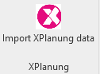
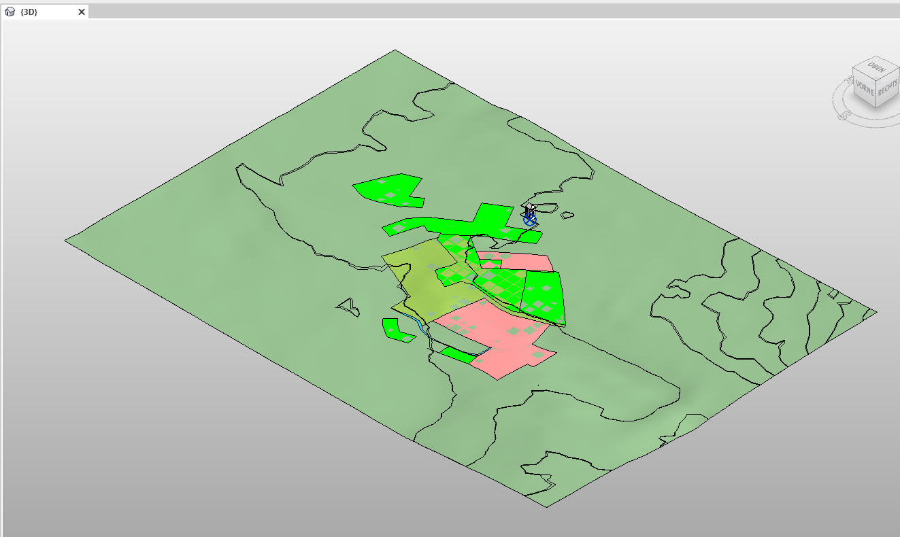
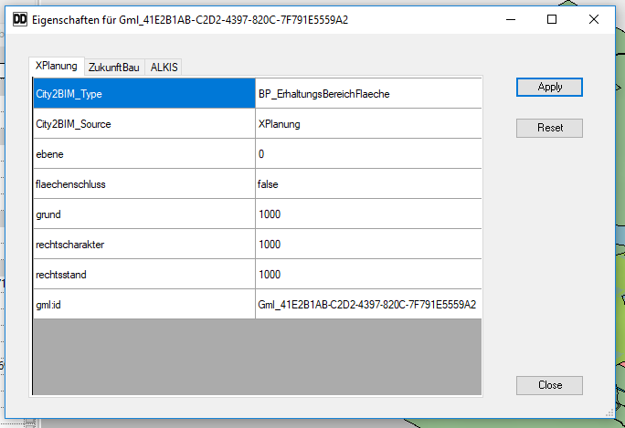
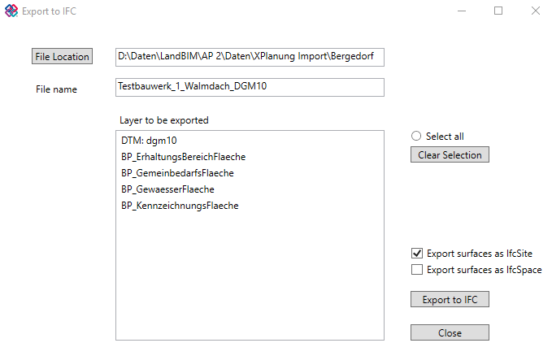
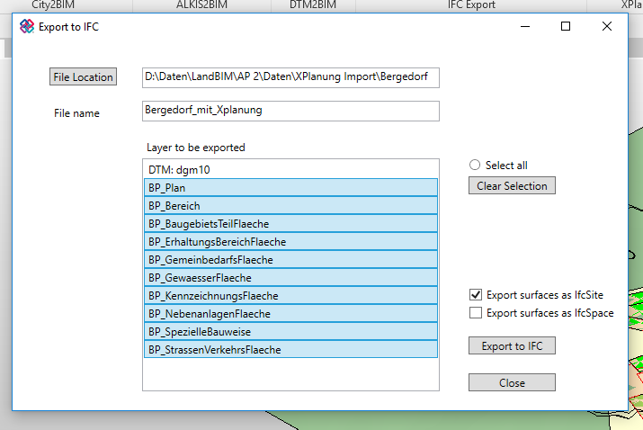
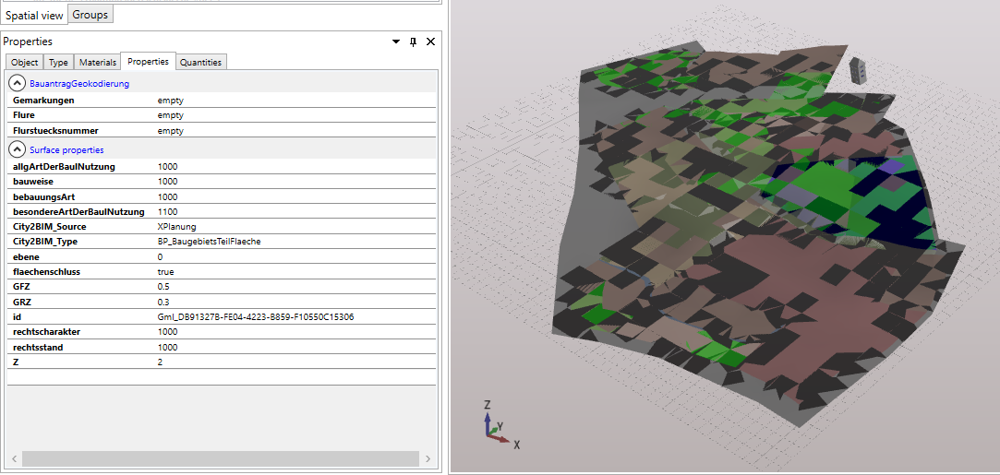
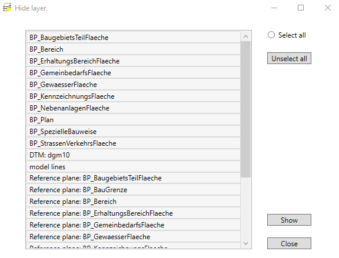

# City2RVT - Plugin zum Import von amtlichen Geodaten - Teil 2

## Überblick

**Weiterarbeit und Erweiterung des City2RVT-Plugins** im Rahmen des Forschungsprojekts "LandBIM" (01.08.2019 bis 31.07.2021, HTW Dresden, Fakultät Geoinformation). Folgende Funktionen sind hierbei hinzugekommen:

- **XPlanung/Import XPlanung-file:** Import von XPlanung-Daten (Daten der Bauleitplanung)
- **Xplanung/Exports XPlanung to IFC:** Eigener IFC-Exporter mit der Möglichkeit, zu exportierende Daten zu filtern
- **Modify/Hide Layer in view: **Tool zum Ein- und Ausblenden importierter Ebenen nach Themenkomplexen
- **Properties/Properties to edit: ** Anzeige, Editierung und Speicherung von Sachdaten als übersichtlichere Alternative gegenüber "Shared parameters"
- Führung von Sachdaten in Revit "Data storages"

## Installation

Für Hinweise zur Installation sei auf Teil 1 der Dokumentation verwiesen.

## Import XPlanung data

### Funktion

Mit dieser Funktion können Daten der XPlanung, also Bauleitplanungsdaten, in die BIM Autorensoftware Autodesk Revit importiert werden. 

### Voraussetzungen

Folgende Voraussetzungen müssen erfüllt sein bzw. vorliegen:

- XPlanung-Datei im *.gml Format
- Autodesk Revit Projekt, wobei der Projektbasispunkt im Projektgebiet der XPlanung-Datei liegen muss (grob reicht)

### Oberfläche

Nach Aufruf des Buttons "Import XPlanung data" öffnet sich folgende GUI: 

Folgende Schritte sind zu tätigen:

1. **Browse: ** die zu importierende XPlanung-GML-Datei suchen und öffnen. Der Dateipfad erscheint in der Textbox. 
2. **Apply: ** die in der Datei enthaltenen Layer (oder auch Themen) werden angezeigt. 
3. **Auswählen der Layer: ** Es können beliebig viele (mindestens ein) Layer für den Import ausgewählt werden. Mit dem Radiobutton "Select all" oder dem Button "Clear Selection" können alle Layer an- bzw. abgewählt werden. 
4. (optional) **Modify parameters: ** hier können für vorher ausgewählte Layer Parameter an- oder abgewählt werden. Abgewählte werden dementsprechend vom Import ausgeschlossen. Wird diese Option nicht genutzt werden standardmäßig alle Sachdaten importiert. 
5. (optional) **Z-Offset für Layer: ** mit dieser Checkbox kann festgelegt werden, dass die Layer in Z-Richtung ein Offset erhalten. Dies kann zur besseren Darstellung hilfreich sein. Standardmäßig werden alle Layer in einer Ebene erzeugt. 
6. (optional) **drape XPlanung: ** wird diese Option angewählt, werden die importierten Flächen auf das Gelände drapiert. Dazu muss natürlich ein Gelände im Projekt vorhanden sein (ggf. über "Get Terrain data" importieren). Sollte kein Gelände vorliegen, werden die Ebenen nicht drapiert. Sollte ein Gelände vorliegen, wird dieses für das Drapieren verwendet. Sollten mehrere Gelände vorliege, wird der Nutzer aufgefordert, das zu verwendende Gelände auszuwählen. 
7. **Import: ** startet den Import. 

### Beispiel

Eingabemaske:

Ergebnis in Revit:

## Export data to IFC (new)

### Funktion

Hiermit können die importierten Daten nach IFC exportiert werden. Der Export kann dabei noch angepasst werden. Für die Flächen wurde eine eigene Exportlogik verfasst. Für Gebäude wird die Exportlogik von Revit verwendet.

### Voraussetzungen

- Ein Revit Projekt mit den importierten originären Daten (XPlanung oder ALKIS) muss vorhanden sein. 
- (optional) Ein IFC Viewer zum betrachten der exportierten IFC-Datei (z.B. XBIM Xplorer, FZK Viewer, Solibri Model Viewer) bzw. ein Texteditor zum betrachten der Struktur der IFC Datei (z.B. Notepad)

### Oberfläche

Folgende GUI öffnet sich nach Aufruf des Buttons "Export data to IFC (new)":

Folgende Schritte sind zu tätigen:

1. **File Location: ** Der Default-Wert ist der Ordner, in der sich die zuvor importierte GML- bzw. XML-Datei befindet. Der Ordner kann über den Button geändert werden. 
2. **File name: ** Als Default-Wert wird der Name des Revit Projekts verwendet. Der Name verändert werden. 
3. **Layer to be exported: ** In dieser Textbox sind alle Layer des Revit Projekts aufgelistet. Zu exportierende Layer sind anzuwählen. Über die Buttons "Select all" und "Clear Selection" können alle Layer an- bzw. abgewählt werden. 
4. **Export surfaces as IfcSite: ** Standardmäßig angewählt. Gibt an, dass Flächen als IfcSite exportiert werden.
5. (optional) **Export surfaces as IfcSpace: ** Hier werden Flächen zusätzlich als IfcSpace exportiert. Diese Funktion dient der Umsetzung der Modellierungsrichtlinien für den BIM-basierten Bauantrag von ZukunftBau. 
6. **Export to IFC: ** startet den Export. 

### Beispiel

## Hide Layer in View

### Funktion

Tool zum Ein- und Ausblenden von Ebenen nach Thema.

### Oberfläche

- Auswahl der einzublendenden Layer
- Auswahl bzw. Abwahl aller Layer über "Select all" bzw. "Unselect all"
- **Show: ** Zeigt die ausgewählten Layer im Revit View an und blendet abgewählte Layer aus. 

## Manage Properties

### Funktion

Importierte Sachdaten werden in den Revit Data Storages gespeichert. Diese werden im Revit Projekt geführt, sind für den Nutzer aber unsichtbar. Mit der GUI der Manage Properties Funktion können diese Sachdaten angezeigt werden. Außerdem ist eine Bearbeitung der Daten und Speicherung dieser in den Data storages möglich. 

### Oberfläche

Nach Auswahl einer Fläche und betätigen des "Manage Properties" Buttons öffnet sich folgende GUI:

- **Reiter: ** in den einzelnen Reitern (XPlanung, ZukunftBau, ALKIS) werden die Daten der entsprechenden Themengebiete geführt (je nachdem was importiert wurde). Die Daten können direkt in der Tabelle editiert werden. 
- **Apply: ** Sollten Daten editiert worden sein, können die Änderungen mit "Apply" bestätigt werden. Das bewirkt, dass die geänderten Daten im Revit Data storage gespeichert werden. 
- **Reset: ** Die Daten der ausgewählten Fläche können auch wieder auf ihren originären Stand zurückgesetzt werden. Nach Betätigung des Buttons ist die originäre GML- bzw. XML-Datei auszuwählen und die Daten werden auf diesen Stand zurückgesetzt. Damit die Änderungen gespeichert werden ist wieder "Apply" zu bestätigen. 

