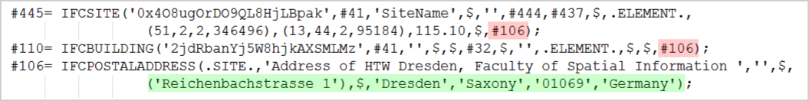
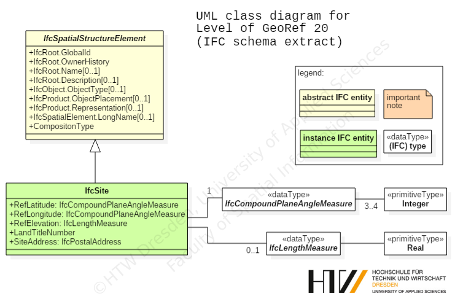
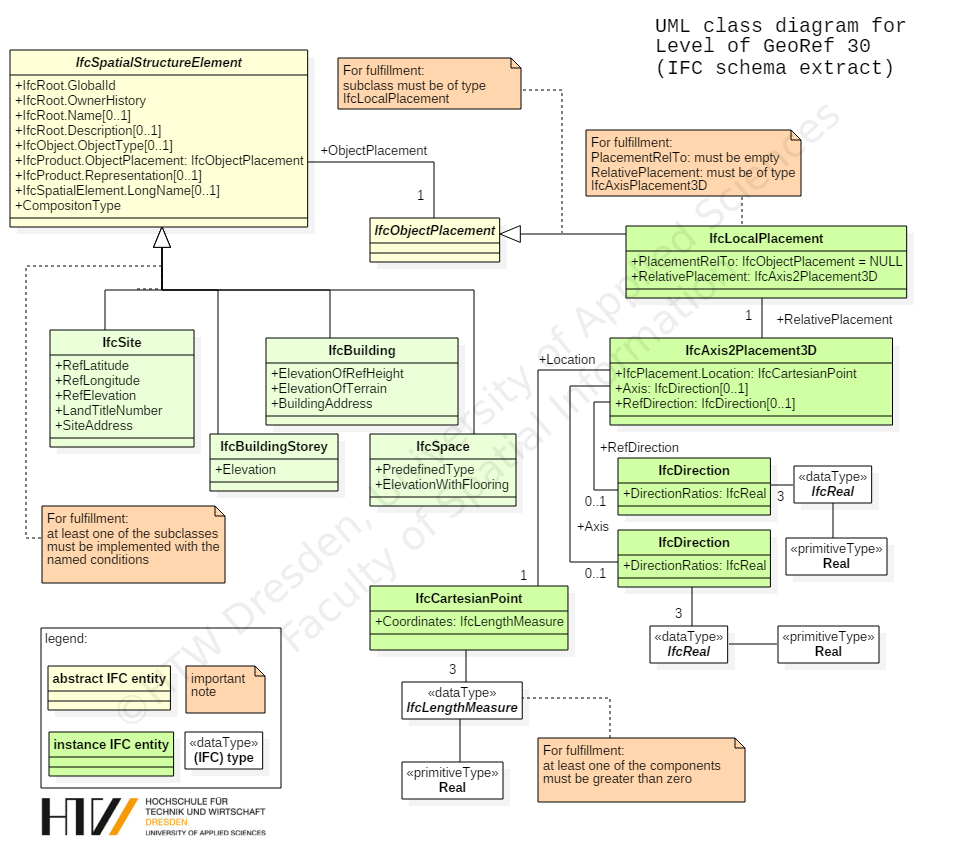
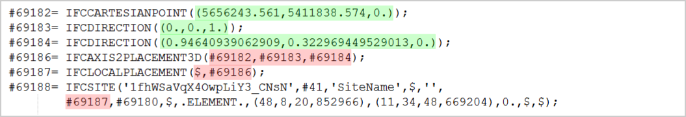
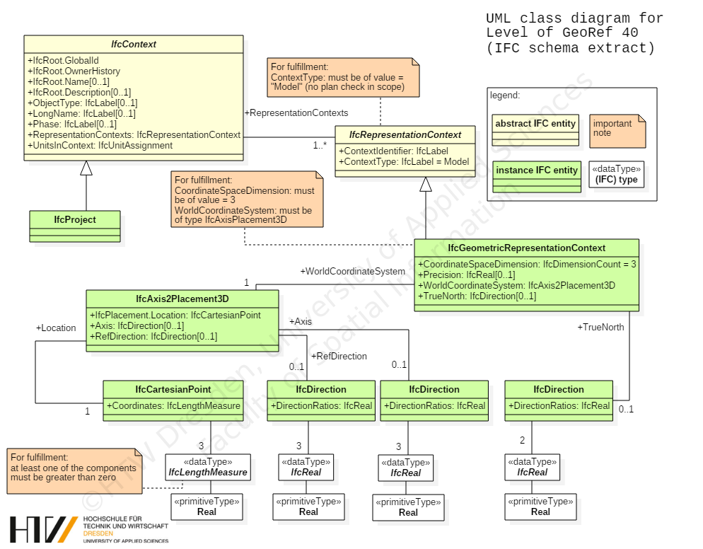
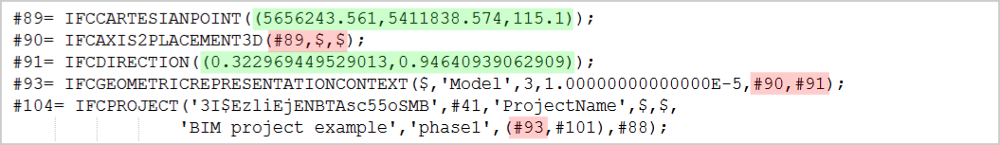
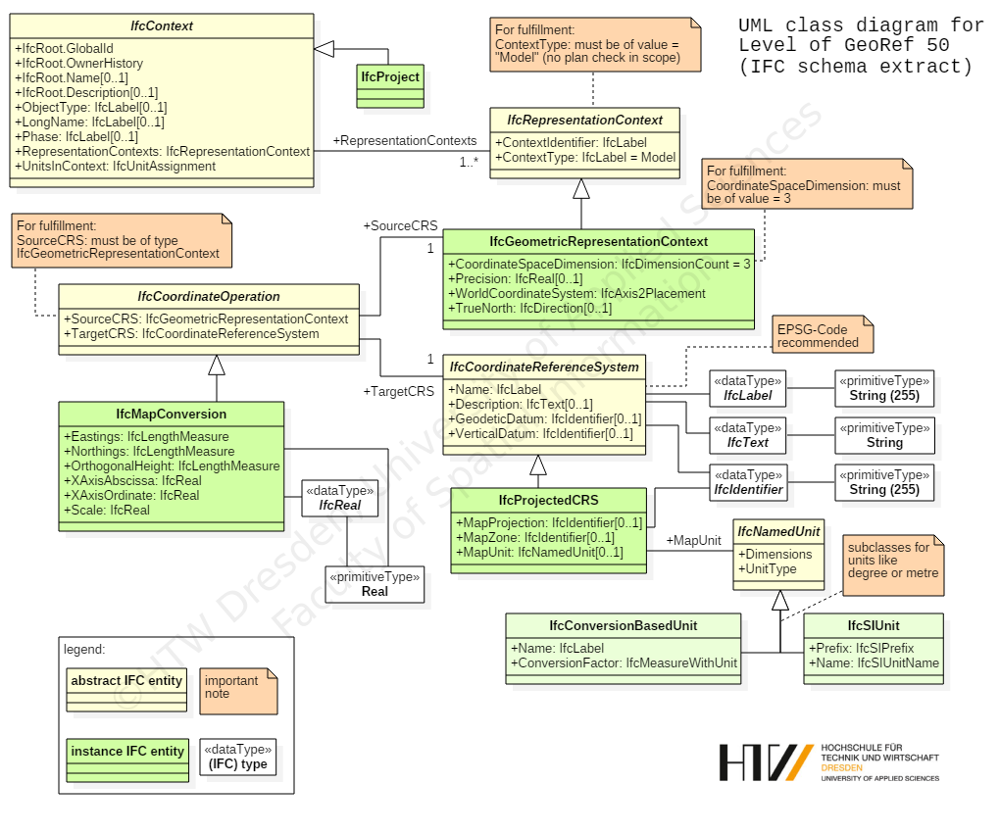
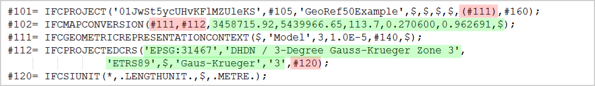
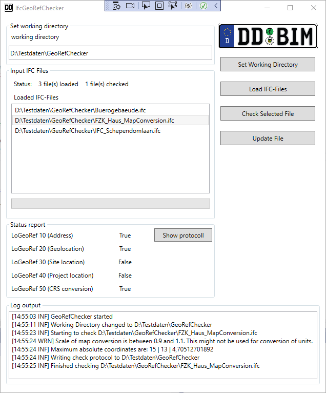

#  IFCGeoRefChecker-Documentation 

This document introduces a new concept for the evaluation of stored georeferencing attributes in IFC files.  It also provides description of the functionality of the introduced IFCGeoRefChecker tool in this document.

[TOC]

## The -Level of Georeferencing- concept

Making geodata available in a BIM project is an important task for all kind of personnel involved in BIM processes. Attributes for location and rotation towards the north direction should be stored in a correct manner for further project steps. The common open data exchange format in the field of BIM are the Industry Foundation Classes (IFC). There are some ways described by the official IFC documentation to store georeferencing attributes in an IFC-file. The official IFC documentation and standard allow multiple ways to store georeferencing attributes in an IFC-File.

Our concept classifies the different ways  of georeferencing in so called Levels of Georeferencing (LoGeoRef). 

Alltogether five level (10, 20, 30, 40 and 50) are available describing how  the georeferencing of an object can be applied. The higher the LoGeoRef is the more quality of georeferencing can be expected by the designated file.  It should be noted that information  from higher levels do not automatically include information out of lower levels and vice versa. Each level comprises their own IFC-schema attributes and  is standing on its own.

Consequently, an IFC-file can fulfill conditions of more than one "Level of GeoRef".

The following subsections contain an explanation for every level of georef and provide the particular extract of the IFC schema that has to be fulfilled for the classification into the respective level.

###  LoGeoRef 10

The simplest way to describe where a site or a building is located is to add an address to the BIM project. Advantages are the easy human readability and the simple understanding of such an address. For georeferencing purposes, it is only a rough approximation for setting the location of the site or the building. Nevertheless, it can be helpful for integrating GIS data like adding data of surrounding city models.

The IFC schema provides an entity for storing  address data in an IFC-file. The entity IfcPostalAddress contains multiple attributes including address lines, postal code, town, region and country. For a correct assignment to a spatial structure element, the IfcPostalAddress object has to be referenced by either IfcSite or IfcBuilding. Both entities include a certain attribute for address referencing.

For better understanding, please refer to the following class diagram:


A corresponding IFC-file with fulfilment of the "LoGeoRef10" conditions would contain the following instances:



The file contains an instance of IfcPostalAddress with information for georeferencing highlighted in the green frame. In this case the address is referenced by an instance of IfcSite and an instance of IfcBuilding (red frames). Please note that for fulfilling LoGeoRef 10 the IfcPostalAdress does not has to be referenced in both entities. 

###  LoGeoRef 20

There is another relative simple way for georeferencing IFC-files. For compliance with LoGeoref 20, instances of IfcSite must contain values for their attributes RefLatitude and RefLongitude. As their names suggest an IFC model is able to store one single point coordinate with longitude and latitude directly in IfcSite. According to the IFC schema definition its values are geographic coordinates with respect to  the World Geodetic System (WGS84 with EPSG:4326). Besides of that, it is also possible to store a value for the elevation in the corresponding attribute RefElevation. By definition, RefElevation should have a metric value related to a locally used datum relative to the sea level. However, there is no default possibility given to write the datum´s name explicit in the file. This also applies to latitude and longitude with its usage of WGS84.

For better understanding, please refer to the following class diagram:



The corresponding IFC-file only needs to contain an instance of IfcSite with the attributes RefLatitude / RefLongitude and RefElevation.


Latitude and longitude are stored as comma-separated integers fulfilling the conditions of the IFC-type IfcCompoundPlaneAngleMeasure. There can be three or four integers describing the required angle. The first value stands for the degree, the second for the minutes, the third for the seconds and the optional fourth for the millionth-seconds part of the angle. This shows that it is possible to set a point coordinate for IfcSite in a very accurate way. LoGeoRef20 does not include possibilities to store any rotation parameters, though.

###  LoGeoRef 30

This level describes the possibility to store the location of any IfcSpatialStructureElement directly in its LocalPlacement-object. Subclasses that can be instantiated in an IFC-file are IfcSite, IfcBuilding, IfcBuildingStorey or IfcSpace. As an important constraint, this level applies only to those spatial structure elements that do not have a relative placement to another spatial structure element. Therefore, the attribute PlacmentRelTo of the IfcLocalPlacement-object belonging to the IfcSpatialStructureElement should be empty. Usually this is the same spatial element which is also the uppermost element in the spatial hierarchy. According to the IFC schema definition this should always be an IfcSite-object.

Since the attribute RelativePlacement is of type IfcAxis2Placement3D, there are possibilities to store X, Y and Z coordinates for the location and vector components for an angle specification for a rotation of the X-axis and the Z-axis.

This makes it possible to store both georeferenced coordinates in the attribute Location indicating metric values in an arbitrary coordinate reference system and to store any rotation values via setting the vector components of the specific Axis respectively RefDirection attribute.

For better understanding, please refer to the following class diagram:



A corresponding IFC-file contains the following instances for satisfying this level:



The example above contains the definitions for an IfcSite-object which is georeferenced by an Location stored in IfcCartesianPoint. The file also applies values for a rotation of the X-axis (#69184). There is no rotation of the Z-axis but nevertheless the default direction must be stored in an IfcDirection instance (#69183). Please keep in mind that this level also contains no information whether the stored location and rotation is local or referred to a global coordinate reference system.

###  LoGeoRef 40

This level provides two main attributes to store georeferencing attributes in an IFC-file. Both WolrdCoordinateSystem and TrueNorth are part of the IfcGeometricRepresentationContext of an instantiated IfcProject. According to the IFC schema defintion every IFC-file contains an IfcProject and also at least one referenced IfcGeometricRepresentationContext with the attribute ContextType given as "Model". 

It is also possible to set up a coordinate system for the 3D-model context of the project via the attribute WorldCoordinateSystem. 

The other attributes follow the same rule as mentioned in previous LoGeoRef 30. A location stored in an instance of IfcCartesianPoint and optional directions for X- and Z-axis, stored in instances of IfcDirection.

As a second main attribute there is the TrueNorth attribute. This attribute is used in case that the Y-axis of the given WorldCoordinateSystem does not point to the global northing. That means that this is another way to set a rotation for the XY-plane. In consequence, the corresponding IfcDirection can only store two vector components.

For better understanding, please refer to the following class diagram:



IFC-files with instances from above could look like the following:



In the example the IfcGeometricRepresentationContext contains a georeferenced location in IfcCartesianPoint. Its directions are optional and not explicitly given. That means they use their default directions for X-axis (1/0/0) and Z-axis (0/0/1). In addition, there is a rotation towards the XY-plane given in IfcDirection (#91).

 The example shows the possibility to store georeferenced coordinates and rotations for the whole project context and not only for a certain (spatial) element. Furthermore the TrueNorth attribute provides the option to set a distortion directly relative to the north direction.

However, those options could be confusing and redundant when direction attributes are set at WorldCoordinateSystem and TrueNorth.

###  LoGeoRef 50

This level provides the highest quality regarding the georeferencing of an IFC-file. It is only available in IFC-files since IFC schema version 4. So it is important to note that no IFC-file previous to IFC4 can fulfill this level.

With IFC schema version 4 buildingSMART introduced some entities especially for georeferencing purposes. In particular, there is a class named IfcMapConversion where the offset between project coordinate system and the global origin of a coordinate reference system should be stored within the attributes Eastings, Northings and OrthogonalHeight for global elevation. The rotation for the XY-plane will be stored using the attributes XAxisAbscissa and XAxisOrdinate. Each attribute stores one vector component of the resulting angle (unlike the TrueNorth attribute with both vector components, see LoGeoRef 40). With the attribute Scale a distortion of distances can be introduced.

The connection to the project is made by the attribute SourceCRS that inherited from IfcCoordinateOperation. As a constraint of this level SourceCRS must be of type IfcGeomtricRepresentationContext. TargetCRS is consequently the Coordinate Reference System that should apply to the project. For describing these systems, IFC4 is able to store data regarding the CRS via an instance of IfcProjectedCRS. By schema definition it is recommended to specify the CRS with an EPSG-code. However, it can also be specified via the other attributes of this entity.

For better understanding, please refer to the following class diagram:



A corresponding IFC-file of schema version 4 contains the following instances for satisfying LoGeoRef50:



The sample file shows that this level does not need any Placement-entities but uses extra entities for georeferencing. So it is possible to handle conversions between a local enginering system and a coordinate reference system.

## The  - IFCGeoRefChecker - tool

This application serves as lightweight checking tool for the LoGeoRef concept outlined above. It is written in C# using .NET 6.



The tool is able to read and check all attributes with georeferencing content in the choosen IFC-file.
At first, the user has to set the working directory to a directory where you have the permission to write and delete files. The checker tool will need these permissions for full functionality.

After the working directory is set you can load IFC files that shall be checked via the load button. In order to check the file it has to be selected in the list and then the checking is started by clicking the button.

After the check a protocoll is written to the working directory. You can open the protocoll by clicking the Show protocoll button. Depending on the size of the file, the checking process could take some time. If the files are successfully checked the results will be displayed in the Status report box.

If the application is not able to import a certain file it will show a error message with the reason why it can not be imported. In this case you should check the syntax of the file with an appropriate IFC file checker.

## Structure of the resulting log file

Every log file begins with some general information about the file:
- Filename
- IFC schema version
- Check time and date
- Maximum coordinate values for each coordinate dimension to see wether the file contains geo coordinates
- Elevation information for IfcSite and IfcGeometricRepresentationContexts to see if there is a missmatch

In the next sections, the results of each LoGeoRef check are presented sequentially.

##### LoGeoRef10 results

The logfile contains the check results for all possible adresses reference by IfcSite or IfcBuilding. Therefore it is possible to evaluate all Site- and Building-objects regarding their address-attribute. Please notice that this tool will not check the content for its plausibility. It is also possible that the address information will be incomplete caused by the exporting software or incomplete data given by the user of the exporting BIM software.

The result of the check will be true if there is an IfcPostalAddress referenced by IfcSite or IfcBuilding. This could be  comprehensive like the example but can be also very vague for instance if only the country is given.

##### LoGeoRef20 results

The result of the check will be true if there is an IfcSite-object in the IFC-file that includes attribute values for RefLatitude and RefLongitude. In consequence, the elevation must not be given for a true check result but will be read by the checking tool. Usually the latitude and longitude should be geographic coordinates defined in WGS84. If coordinates are available it is also checked where this position is on earth. 

##### LoGeoRef30 results

At first, the check will determine all elements in the IFC-file that have no placement relative to another element´s placement. It is important to consider those elements if the absolute placement, e.g. for IfcSite will be changed afterwards. To guarantee the relative positioning of the named elements to each other it is therefore necessary to add the same value to the other elements which forfill LoGeoref30.

The check result will only be true if one of the components of the stored coordinates in IfcAxis2Placement3D is greater than zero. Obviously a component greater than zero does not make the file automatically to a georeferenced one but this is a first indicator that there could be a georeferencing for this level. Clear statements could only be made by users through a critical reflection of the stored values.

##### LoGeoRef 40 results

This check examines the WordlCoordinateSystem and the TrueNorth attributes of the project model context in an IFC-file. At first, the tool will pick out the mandatory IfcGeometricRepresentationContext object with type "Model" in the file. This context sets the coordinate system of the model view of a project. Its location is stored in the WorldCoordinateSystem´s placement object. Similarly to the previous level this coordinate system will be set up via X,Y and Z as location and optional with rotation of X- and Z-axis.

In addition the tool will analyse the values in the TrueNorth attribute for checking of an applied rotation of the XY-plane towards TrueNorth.

If the logfile contains a second object for LoGeoRef40, that will be an optionally written Context for the plan view of the project. If values will be changed both of them should get the same values.

Please consider that the result value only will be true if one of the locations coordinate components will be greater than zero again. Reasons for that are similar to the statements at the previous level. 

##### LoGeoRef 50 results

Please note that this level could only be true if you check an IFC-file written in respect to IFC schema version 4 or later. The checking tool will look for an element of IfcMapConversion in the file. As a second constraint for a true result its source and target attributes must forfill the conditions of LoGeoref 50 (see the UML diagram in the concept section).

Please consider that the validity of the written data is in the mission of the user or rather of the exporting BIM software that is used for exporting IFC-files.


### Checking IFC-files using command-line arguments

As an alternative to the graphical user interface, it is possible to use the IFCGeoRefCheckerCommand.exe for checking the level of georeferencing of multiple IFC-files at once (and creating log- or json files that display the results).
For that, a *.json file is required, that contains the filepath and -name of the IFC-files to be checked, an output path and information wether log and/or json result files shall be created.
Such an input json file could look like this:

```
{
  "InputObjects":
  [
    {
      "fileName": "D:\\Data\\IFCfiles\\TestObject1.ifc"
    },
    {
	  "fileName": "D:\\Data\\IFCfiles\\TestObject2.ifc"
	},
    {
	  "fileName": "D:\\Data\\IFCfiles\\TestObject3.ifc"
	}
  ],
  "outputDirectory": "D:\\Data\\Output",
  "outLog": true,
  "outJson": false
}

```
- "InputObjects" is a list object, that can contain any number of "fileName" string-objects. They contain paths and filenames of the IFC-files to be checked.
- "outputdirectory" is also a string-object, that contains the path where the log- and json-files shall be created.
- "outLog" and "outJson" contain boolean values that determine wether a logfile (*.txt) and/or a json file shall be created.

Once the input.json file is ready you can use the console (cmd) to run the IFCGeoRefCheckerCommand.exe with the filepath of the input.json as a command line argument. For example:
```
IFCGeoRefCheckerCommand.exe "D:\Data\input\Sample.json"

```
### Errors that may occur

**While File Import (1):**

- Possible reason: bad syntax errors in IFC-file 
- Proposed solution: check IFC-file for valid syntax with an appropriate tool (e.g. FZKViewer from KIT)


**While File Import (2):**

- Possible reason: IfcSchemaVersion outside XBIM functionality (not IFC2X3, IFC4 or IFC4x1)
- Proposed solution: not in scope, but maybe dirty hack in IFC-file helps: change FILE SCHEMA in Header Section to IFC2X3, IFC4 or IFC4X1

**While GeoRef Check:**

- Description: no error, but fields in tab are empty
- Possible reason: IFC-file does not contain reference objects -> if it occurs syntax is not valid against IFC schema 
- Proposed solution: ignore or new export in originating software

**While GeoRef Compare:**

- Description: "Index out of range" exception occurs 
- Possible reason: IFC-file does not contain reference objects -> if it occurs syntax is not valid against IFC schema 
- Proposed solution: ignore or new export in originating software (nevertheless Comparison-file will be written)


**While Opening Log and/or JSON files:**

- Possible reason: no standard program for .txt and/or .json files is set in your system
- Proposed solution: set a standard program for opening of .txt and/or .json files, e. g. editor

## Built with

- [xBIM Toolkit](http://docs.xbim.net/) - Main functionality used to read IFC-files
- [Json.NET](https://www.newtonsoft.com/json) - Functionality for exporting JSON-files
- [Pixabay](https://pixabay.com/) - Graphics used to design LoGeoRef-Icons

## Contributors

The concept together with the tool was developed within the scope of the following sponsorship projects:

| 3D-Punktwolke - CityBIM  | Digitalisierung des Bauwesens - DD BIM |
|--------|--------|
|       |   Supported by: <br>  <br> Landeshauptstadt Dresden <br>Amt für Wirtschaftsförderung |

## Contact

   

**HTW Dresden**
**Fakultät Geoinformation**
Friedrich-List-Platz 1
01069 Dresden

Project head:

- Prof. Dr.-Ing. Christian Clemen (<christian.clemen@htw-dresden.de>)

Project staff:

- Hendrik Görne, M.Eng. (<hendrik.goerne@htw-dresden.de>)
- Tim Kaiser, M.Eng.
- Enrico Romanschek, M.Eng.


## License

This project is licensed under the MIT License:

```
Copyright (c) 2018 HTW Dresden

Permission is hereby granted, free of charge, to any person obtaining a copy
of this software and associated documentation files (the "Software"), to deal
in the Software without restriction, including without limitation the rights
to use, copy, modify, merge, publish, distribute, sublicense, and/or sell
copies of the Software, and to permit persons to whom the Software is
furnished to do so, subject to the following conditions:

The above copyright notice and this permission notice shall be included in all
copies or substantial portions of the Software.

THE SOFTWARE IS PROVIDED "AS IS", WITHOUT WARRANTY OF ANY KIND, EXPRESS OR
IMPLIED, INCLUDING BUT NOT LIMITED TO THE WARRANTIES OF MERCHANTABILITY,
FITNESS FOR A PARTICULAR PURPOSE AND NONINFRINGEMENT. IN NO EVENT SHALL THE
AUTHORS OR COPYRIGHT HOLDERS BE LIABLE FOR ANY CLAIM, DAMAGES OR OTHER
LIABILITY, WHETHER IN AN ACTION OF CONTRACT, TORT OR OTHERWISE, ARISING FROM,
OUT OF OR IN CONNECTION WITH THE SOFTWARE OR THE USE OR OTHER DEALINGS IN THE
SOFTWARE.

```


