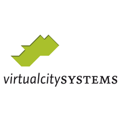
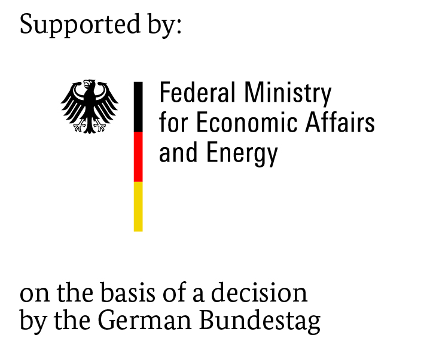
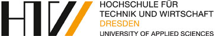

### Welcome to the open source project for **GIS-BIM integration** of  **HTW Dresden**. 

We provide for the BIM authoring software **Revit** a small Plugin. This includes:

- City2RVT - Import of **administrative geodata** (ALKIS themes, grid DTM, DXF conversion)
- City2BIM - Import of **3D city models** (CityGML buildings, ALKIS parcels, ALKIS land uses, ALKIS building surrounds)
- City2IFC - improved **export to IFC** (work in progress)

For the **openBIM** context we provide a small open source software **IfcTerrain**. For creating digital terrain models (DTM) using the IndustryFoundation Classes (IFC) for “openBIM” (vender neutral Building Information Modelling) projects. The software can convert many standard formats and model representations of DTM. 

---

### *Want to know more?* Please check out our [**GitHub wiki pages**](https://github.com/dd-bim/City2BIM/wiki).

---

### **Releases:**

Here you can find our latest releases:

- [**City2BIM - Revit Plugin**](https://github.com/dd-bim/City2BIM/releases/) (**Overview**)

  direct download links:

  - [**Setup.msi**](https://github.com/dd-bim/City2BIM/releases/download/v1.5.0/Setup_Revit_2020.msi) (easy and fast support)
  - Source code ([***.zip**](https://github.com/dd-bim/City2BIM/archive/refs/tags/v1.5.0.zip); [***.tar.gz**](https://github.com/dd-bim/City2BIM/archive/refs/tags/v1.5.0.tar.gz)) (for developer)

- [**IFCTerrain**](https://github.com/dd-bim/City2BIM/releases/download/v1.5.0/IFCTerrain.zip) (Version 1.4 - direct download)

---

### Feedback:

If you have found an bug or have suggestions for improvement, please feel free to contact us!

---

### Support

| in association with                                          | supported by                                                 |
| ------------------------------------------------------------ | ------------------------------------------------------------ |
|  |  |

## Contact

   

**HTW Dresden**
**Faculty Geoinformation**
Friedrich-List-Platz 1
01069 Dresden

**Project head:** Prof. Dr.-Ing. Christian Clemen

**Project staff:**

- Tim Kaiser, M.Eng.
- Enrico Romanschek, M.Eng.
- Marcus Schröder, M.Eng.

**Former project staff:**

- Hendrik Görne, M.Eng.
- Sören Meier, M.Eng.

## License

*This project is licensed under the **MIT License**:*

```
Copyright (c) 2020 HTW Dresden

Permission is hereby granted, free of charge, to any person obtaining a copy
of this software and associated documentation files (the "Software"), to deal
in the Software without restriction, including without limitation the rights
to use, copy, modify, merge, publish, distribute, sublicense, and/or sell
copies of the Software, and to permit persons to whom the Software is
furnished to do so, subject to the following conditions:

The above copyright notice and this permission notice shall be included in all
copies or substantial portions of the Software.

THE SOFTWARE IS PROVIDED "AS IS", WITHOUT WARRANTY OF ANY KIND, EXPRESS OR
IMPLIED, INCLUDING BUT NOT LIMITED TO THE WARRANTIES OF MERCHANTABILITY,
FITNESS FOR A PARTICULAR PURPOSE AND NONINFRINGEMENT. IN NO EVENT SHALL THE
AUTHORS OR COPYRIGHT HOLDERS BE LIABLE FOR ANY CLAIM, DAMAGES OR OTHER
LIABILITY, WHETHER IN AN ACTION OF CONTRACT, TORT OR OTHERWISE, ARISING FROM,
OUT OF OR IN CONNECTION WITH THE SOFTWARE OR THE USE OR OTHER DEALINGS IN THE
SOFTWARE.
```

